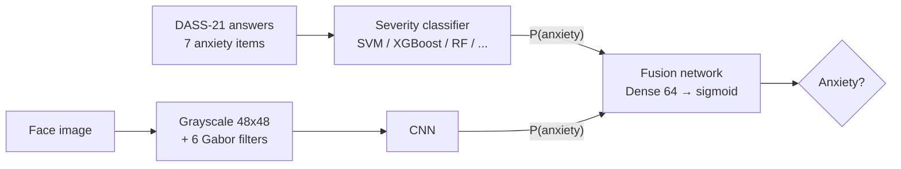

# TI Fusion: Multimodal Anxiety Disorder Detection

Undergraduate thesis project (2023) that detects anxiety by combining two modalities, **T**ext and **I**mage:

- **Text:** answers to the anxiety items of the DASS-21 psychological questionnaire, classified into five severity levels
- **Image:** facial expressions, turned into Gabor texture features and classified with a convolutional neural network
- **Fusion:** a small neural network that combines both models' outputs (late fusion) into a final _anxiety / no anxiety_ decision



## How it works

### 1. Text model: [`notebooks/1_text_dass21_model.ipynb`](notebooks/1_text_dass21_model.ipynb)

- 580 DASS-21 responses are reduced to the seven anxiety items (dry mouth, breathing difficulty, trembling, worry about panic, feeling close to panic, awareness of heartbeat, being scared without reason). Duplicate answer patterns are removed so identical rows cannot sit in both train and test sets, leaving 406.
- The item sum × 2 is mapped to the standard DASS severity bands: normal (0-7), mild (8-9), moderate (10-14), severe (15-19) and extremely severe (20+).
- Six classifiers (SVM, XGBoost, Random Forest, Gaussian Naive Bayes, KNN, Decision Tree) are tuned with 10-fold grid search. Minority classes are oversampled inside an `imblearn` pipeline so the oversampling never leaks into validation folds.

| Model         | CV accuracy | Test accuracy | Test F1 (weighted) |
| ------------- | ----------- | ------------- | ------------------ |
| SVM (linear)  | 1.000       | 1.000         | 1.000              |
| XGBoost       | 0.721       | 0.724         | 0.730              |
| Random Forest | 0.690       | 0.672         | 0.675              |
| Gaussian NB   | 0.679       | 0.621         | 0.647              |
| KNN           | 0.645       | 0.603         | 0.631              |
| Decision Tree | 0.641       | 0.603         | 0.616              |

The linear SVM is perfect because the severity label is a linear threshold on the sum of the answers, so a linear decision boundary can reproduce the scoring rule exactly. Tree-based models need many axis-aligned splits to approximate a sum and plateau around 70%.

### 2. Image model: [`notebooks/2_image_gabor_cnn.ipynb`](notebooks/2_image_gabor_cnn.ipynb)

- Faces from **CK+48** and **KDEF** are converted to 48x48 grayscale. Expressions are grouped into _anxiety-related_ (anger, contempt, disgust, sadness, neutral) and _other_ (fear, happiness, surprise).
- Each face is filtered with six Gabor kernels at 0°–150° and the responses are summed, highlighting oriented edges such as brow and mouth wrinkles.
- A LeNet-style CNN (3 conv + pooling blocks with dropout, a 128-unit dense layer and a softmax output) is trained with early stopping and learning-rate reduction on a validation split.
- In the original thesis run the model reached **93.1% accuracy** on 116 test images (precision 0.94, recall 0.93). That run used the test set for early stopping, so the figure is optimistic. The notebook now holds out a separate validation set; re-running it requires the image datasets (see below).

### 3. Late fusion: [`notebooks/3_late_fusion.ipynb`](notebooks/3_late_fusion.ipynb)

- No public dataset has both a questionnaire and a face photo for the same person, so the 116 test questionnaires and 116 test images are paired by position to simulate multimodal subjects.
- A subject is labelled anxious if either modality's true label shows anxiety.
- A fusion network (Dense 64 → sigmoid) takes each model's anxiety probability and predicted label and is compared against each single modality and a simple _either model says anxiety_ rule.
- The notebook ends with an end-to-end `predict_person(image, answers)` function that runs both models and fuses their outputs.

## Getting started

```bash
git clone https://github.com/salehinafnan/anxiety-disorder-detection-using-multimoadal-learning.git
cd anxiety-disorder-detection-using-multimoadal-learning
pip install -r requirements.txt
```

1. The questionnaire data is included, so [notebook 1](notebooks/1_text_dass21_model.ipynb) runs as-is and saves `models/text_model.pkl` and `outputs/text_predictions.csv`.
2. Download CK+48 and KDEF and arrange them as described in [`data/README.md`](data/README.md), then run [notebook 2](notebooks/2_image_gabor_cnn.ipynb).
3. Run [notebook 3](notebooks/3_late_fusion.ipynb) to train and evaluate the fusion model.

Run the notebooks from the `notebooks/` folder; they read and write data through relative paths (`../data`, `../models`, `../outputs`).

## Repository structure

```
data/
  dass21_responses.csv       580 anonymous DASS-21 responses
  organize_kdef.py           sorts KDEF images into emotion folders
  README.md                  where to get the face datasets
notebooks/
  1_text_dass21_model.ipynb  questionnaire severity classifier
  2_image_gabor_cnn.ipynb    Gabor features + CNN on facial expressions
  3_late_fusion.ipynb        fusion network and end-to-end prediction
  preprocessing.py           face loading and Gabor filter bank shared by notebooks 2 and 3
models/, outputs/            created when the notebooks run (git-ignored)
```

## Revisions since the thesis

The code was cleaned up after the thesis was submitted. The main fixes:

- **Saved model.** The questionnaire pipeline pickled the last model in the grid-search loop (Gaussian NB) instead of the best one. It now saves the model with the best cross-validated accuracy.
- **Oversampling leak.** Oversampling ran before cross-validation, so copies of the same sample landed in both training and validation folds and inflated the scores. It now runs inside the CV pipeline.
- **Fusion labels.** The two prediction tables were merged on their label strings. This produced a cross join in which the text label always equalled the image label, so the "fused" target was just the image prediction. They are now paired by position, and the target comes from the true labels, not from the models' own predictions.
- **Single-image inference.** Inference fed raw pixels to a CNN that had been trained on Gabor-filtered, normalised images. Both paths now share the same preprocessing function.
- **Gabor filtering.** The per-pixel Python loop was replaced with `cv2.filter2D`. The output is pixel-identical and about 200× faster.
- **Portability.** Hard-coded Windows paths were replaced with relative paths, and the seven copy-pasted folder loops with data-driven ones.

## Limitations

- The questionnaire and face data come from different people, so the fusion step simulates multimodal subjects rather than measuring real ones.
- Facial expressions of posed emotions are a proxy for anxiety, and the emotion-to-anxiety grouping is a heuristic chosen for this project.
- Because a subject counts as anxious when either modality is positive, and most questionnaire respondents score above _normal_, only a handful of paired subjects are labelled non-anxious. Fusion metrics therefore rest on very few negative examples.
- This is a research prototype, not a diagnostic tool.
